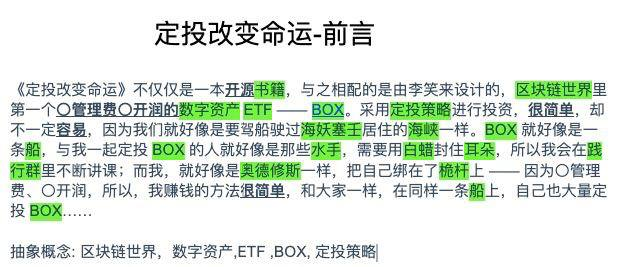

# 5.11日写作打卡

## 题目

阅读以下文字，用圆圈画出名词，用下划线画出名词前面的形容词，然后找出其中的抽象概念。

> 《定投改变命运》不仅仅是一本开源书籍，它还有一个配套产品：由李笑来设计的，区块链世界里第一个〇管理费〇开润的数字资产交易型开放式指数基金（Exchange-Traded Funds，缩写为ETF）——BOX。采用定投策略进行投资，很简单，却不一定容易，因为我们就好像是要驾船驶过海妖塞壬居住的海峡的人一样。BOX就像是一条船，与我一起定投BOX的人就像是那些水手，需要用白蜡封住耳朵，所以我会在践行群里不断讲课来提供“白蜡”；而我，就好像是奥德修斯一样，把自己绑在了桅杆上——因为〇管理费、〇开润，所以，我赚钱的方法很简单，和大家一样，在同样一条船上，自己也大量定投BOX……

## 打卡

