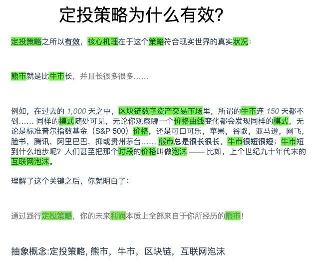
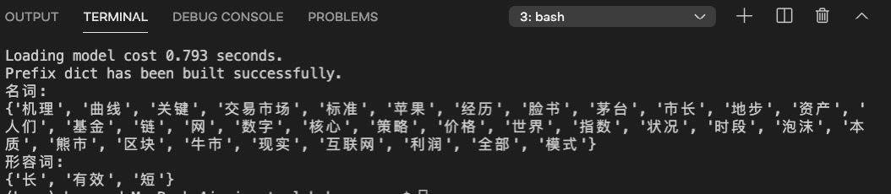

# 5.12日写作打卡

## 题目
    阅读以下文字，用圆圈画出名词，用下划线画出名词前面的形容词，然后找出其中的抽象概念。

> 定投策略之所以有效，核心机理在于这个策略符合现实世界的真实状况：
 熊市就是比牛市长，并且长很多很多……
 例如，在过去的1000天之中，区块链数字资产交易市场里，所谓的牛市连150天都不到。同样的模式随处可见，无论你观察哪一个价格曲线，都会发现同样的模式——标准普尔指数基金（S&P 500）、可口可乐、苹果、谷歌、亚马逊、网飞、脸书、腾讯、阿里巴巴、贵州茅台……熊市总是很长很长，牛市总是很短很短。牛市短到什么地步呢？人们甚至把那个时段的价格叫做泡沫——比如，上个世纪九十年代末的“互联网泡沫”。
 理解了这个关键点之后，你就应该明白了：
 在践行定投策略的整个过程中，你的利润本质上全部来自于你所经历的熊市！

## 打卡
做完训练想验证下分词的准确性，查到GitHub上有这个[jieba-开源的一个中文分词组件](https://github.com/fxsjy/jieba) ，尝试折腾了一下，基本的词性分析好像有点low，有个深度学习的版本有个库始终安装不上，暂时放弃。
* 作业
 
* 开源库执行结果
